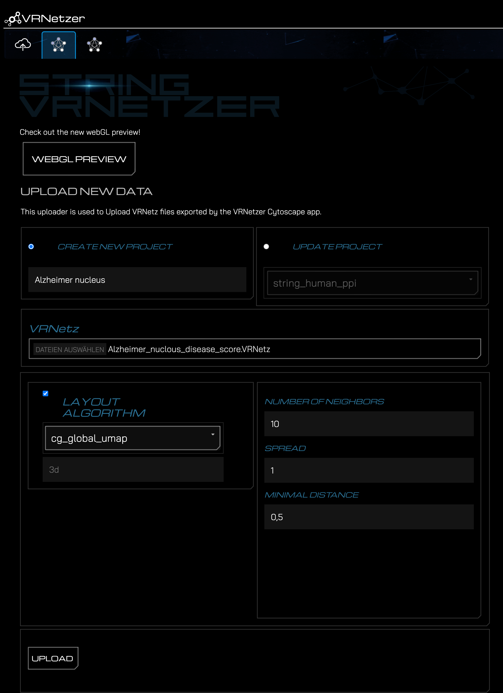
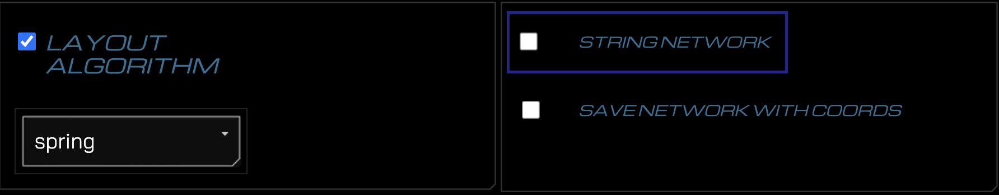
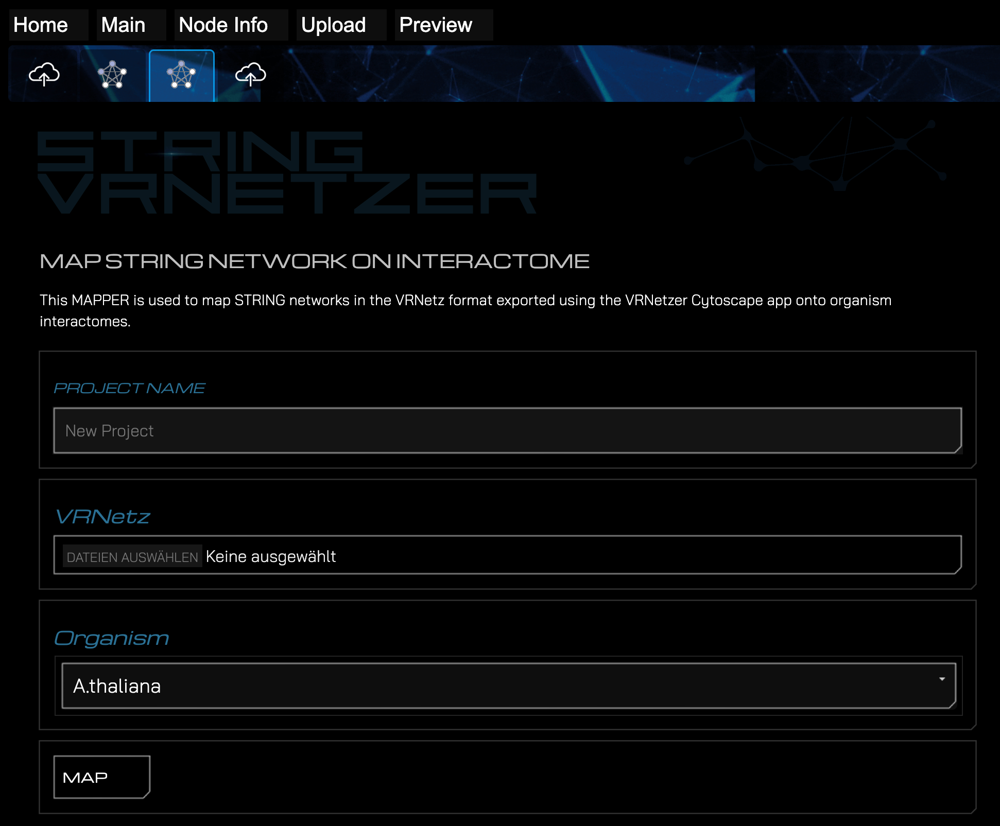

# **STRING-VRNetzer**

This repository includes everything thats needed to bring protein-protein association networks from STRING DB on the VRNetzer platform:

1. A [CytoscapeApp](https://github.com/menchelab/STRING-VRNetzer/blob/main/cytoscapeApp/VRNetzerApp/target/VRNetzerApp-1.0.0.jar) which enables the export of VRNetzer designated data format
2. An VRNetzer extension – [StringEx](https://github.com/menchelab/StringEx) – which enables the visualization of STRING specific features like multiple association evidences

### **Miro Board**

https://miro.com/app/board/uXjVOtKWqXI=/?share_link_id=552918253097

## **Content**

1. [**Installation of the VRNetzerApp**](#App_install)<br>
2. [**Usage of the VRNetzerApp**](#App_usage)<br>
3. [**Installation of StringEx**](#Ex_install)<br>
4. [**Upload a STRING network**](#upload_string)<br>
5. [**Upload an arbitrary VRNetz**](#upload_network)<br>
6. [**Map string network on preprocessed PPI**](#map_network)<br>
7. [**Dependencies**](#Dependencies)<br>
8. [**License**](#License)<br>

<details>
  <summary><h3 id="App_install"><b>1. Installation of the VRNetzerApp</b></h3></summary>
To install it, you can use the App Manger in Cytoscape:<br>
Apps -> App Manger -> Install from File... -> select the "VRNetzerApp-x.x.x.jar" file.
</details>

<details>
  <summary><h3 id="App_usage"><b> 2. Usage of the VRNetzerApp </b></h3></summary>

1. Select a network you would like to export.
2. Export the selected network as an "VRNetz" via:<br>
   a) Apps -> VRNetzer -> Export network as VRNetz<br>
   or <br>
   b) File -> Export -> Export network as VRNetz
3. Select the location where to save the network, as well as a name in the propted window.

You network is now exported as an VRNetz which can be used in the [VRNetzer](https://github.com/menchelab/VRNetzer) to present your network as a 3D network.

</details>

<details>
<summary><h3 id="Ex_install"><b> 3. Installation of StringEx </b></h3></summary>

1.  Add the StringEx directory to your VRNetzer backend directory. The directory should be located at `"extensions/StringEx"`.
2.  Before the line:

```
python -m pip install -r requirements.txt
```

add the following line to the VRNetzer backend's `build and run` script (Windows: `buildandRUN.ps`, Linux: `linux_buildandrun.sh`, Mac: `mac_buildandrun.sh`) :

```
python -m pip install -r extensions/StringEx/requirements.txt
```

If you would like to use cartoGRAPHs to create layouts also add the following line:

```
python -m pip install -r extensions/StringEx/requirements_cartoGRAPHs.txt
```

It should now look something like this:

```
python -m pip install -r extensions/StringEx/requirements.txt
python -m pip install -r extensions/StringEx/requirements_cartoGRAPHs.txt
python -m pip install -r requirements.txt
```

</details>

<details>
<summary><h3 id="upload_string"><b> 4. Upload a STRING network </b></h3></summary>

1. Export a STRING network with the VRNetzerApp from Cytoscape. For further instructions see [here](https://github.com/menchelab/STRING-VRNetzer).
2. Start the VRNetzer backend using the script applicable to your operating system.
3. Navigate in your Browser to http://127.0.0.1:5000/upload (Windows/Linux) / http://127.0.0.1:3000/upload (mac)
4. If the StringEx is correctly installed, you should now see two new tabs. The first is the a VRNetz designated uploader

   

5. On this tab, define a project name, select the VRNetz file of your exported String network, and select the desired layout algorithm.
6. If you are using a cartoGRAPHs layout algorithm, you can also define the respective variables.
7. Click on the "Upload" button to upload the network to the VRNetzer platform.
8. If the upload was successful, you'll be prompted with a success message and a link to preview the project in the designated WebGL previewer.

</details>

<details>
<summary><h3 id="upload_network"><b>5. Upload an arbitrary VRNetz</b></h3></summary>

Do the first six steps as mentioned [above](#upload_string).

7. Uncheck the checkbox `STRING NETWORK`

   

8. Click on the "Upload" button to upload the network to the VRNetzer platform.
9. If the upload was successful, you'll be prompted with a success message and a link to preview the project in the designated WebGL previewer.
</details>

<details>
<summary><h3 id="map_network"><b>6. Map an exported network on a preprocessed PPI</b></h3></summary>

Do the first three steps as mentioned [above](#upload_string).

4. The second tab is the STRING mapper.

   

5. On this tab, define a project name, select the VRNetz file of your exported String network, and select the organism from which your VRNetz originates of.
6. Click on the "Map" button to map the network with the preprocessed PPI.
7. If the upload was successful, you'll be prompted with a success message and a link to preview the project in the designated WebGL previewer.

</details>

## **Dependencies**

[Cytoscape - StringApp](https://apps.cytoscape.org/apps/stringapp)
[Cytoscape - VRNetzerApp](https://apps.cytoscape.org/apps/stringapp)
[VRNetzer - StringEx](https://apps.cytoscape.org/apps/stringapp)

## **Software**

[VRNetzer](https://github.com/menchelab/VRNetzer_Backend)<br>
[Cytoscape v3.8. ++](https://cytoscape.org/)<br>

## **License**

Copyright (c) 2022 Menche Lab

This project is licensed under the terms of the MIT license. Check the LICENSE.md file for details.
